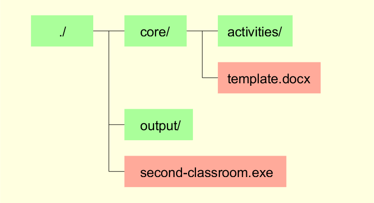
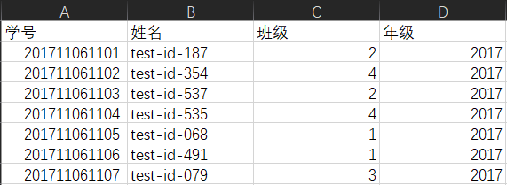
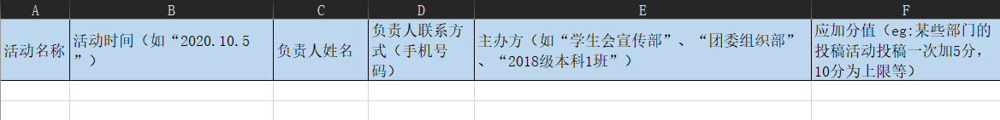
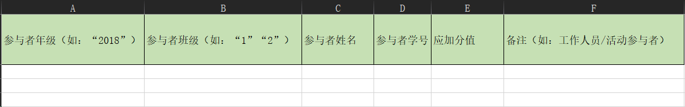

# Second-Classroom - 第二课堂

## 1 简介

第二课堂(Second-Classroom)是使用Node.js编写，对北京师范大学心理学部本科生年度综合测评数据进行整合的命令行工具，当前功能包括整合学生信息、活动信息并生成汇总的excel文件以及所有个人综测信息的word文件。当前版本已对原JavaScript文件进行打包，可直接在Windows 10系统下运行，无需配置node环境。

使用Second-Classroom的基本流程包括：登记学生信息 -> 注册活动信息 -> 转换生成汇总的excel文件以及所有个人综测信息的word文件。其中，登记学生信息和注册活动信息的步骤只需用户提供符合格式的.xlsx文件，Second-Classroom会自动将其转换为.json文件并进行存储；最终生成excel文档和word文档的步骤无需原始记录学生信息和活动信息的excel文件，而是依托于此前生成的.json文件。

## 2 准备工作

在使用Second-Classroom前，应检查second-classroom.exe所在路径的文件结构是否如下图所示。其中，若缺少activities文件夹和output文件夹，Second-Classroom会将其自动生成，但其他文件 / 文件夹是必须始终存在的。其中，activities用于存放活动信息的json文件，template.docx为个人综测信息的word模板，而转换后的学生信息文件也会存放着core文件夹内；生成后的word文档和excel文档都会存放在output文件夹内。

## 3 学生信息

学生信息应该被储存在一个.xlsx文件的第一个sheet当中并从A1单元格开始，且应该有着如下图所示的结构。

## 4 活动信息

活动信息应该被储存在一个包含2个sheet的.xlsx文件，其中第一个sheet存储活动相关信息，第二个sheet存储参与人员信息，该excel文档应该有着如下图所示的结构。

当前版本的Second-Classroom会自动对待注册的活动进行检查，如果已经存在以当前活动名注册的活动，则不会为当前活动进行注册；同时，对当前活动进行注册时，会自动检查参与人员信息与已登记的学生信息是否匹配，若出现不在已登记的学生信息中的学生或学生信息错误，则不会为当前活动进行注册。因此在每次重新登记学生信息，都应该为已经注册的活动进行重新注册。

## 5 使用
<table style='font-family: "Consolas", "宋体"' cellspacing="0" width="100%">
    <thead>
        <tr>
            <th>指令</th>
            <th>功能</th>
            <th>参数</th>
            <th>示例</th>
        </tr>
    </thead>
    <tbody>
        <tr>
            <td>-e</td>
            <td>生成excel文件</td>
            <td>无</td>
            <td>second-classroom.exe -e</td>
        </tr>
        <tr>
            <td>-i</td>
            <td>登记学生信息</td>
            <td>学生信息的xlsx文件的相对路径或绝对路径</td>
            <td>second-classroom.exe -i test\测试-人员名单.xlsx</td>
        </tr>
        <tr>
            <td rowspan="2">-r</td>
            <td rowspan="2">注册活动信息</td>
            <td rowspan="2">活动信息的xlsx文件或文件夹的相对路径或绝对路径</td>
            <td>second-classroom.exe -r test\活动1.xlsx</td>
        </tr>
        <tr>
            <td>second-classroom.exe -r test\activities</td>
        </tr>
        <tr>
            <td>-v</td>
            <td>查看版本信息</td>
            <td>无</td>
            <td>second-classroom.exe -v</td>
        </tr>
        <tr>
            <td>-w</td>
            <td>生成word文件</td>
            <td>无</td>
            <td>second-classroom.exe -w</td>
        </tr>
    </tbody>
</table>

## 6 测试

node测试和exe测试分别使用node-test.bat和exe-test.bat
